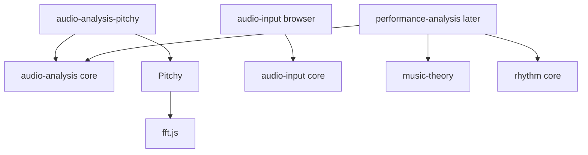

# Audio input tooling plan

Draft proposal, 2026-10-05. Pitchy is the agreed detector for monophonic pitch; see [the research and decision](audio-input-research.md). The package layout and contracts below are proposals for review, not settled APIs or an instruction to implement them.

The [concrete implementation plan](audio-input-implementation-plan.md) now defines the proposed delivery sequence, module ownership, and acceptance checks. This document retains the design rationale and future-exercise requirements; use the implementation plan for the work sequence.

The goal is reusable tooling for microphone capture, clap onsets, recorded pitch, and live pitch, with low dependencies. Recommend three small packages in one new repository: `@polyhymnia/audio-input`, `@polyhymnia/audio-analysis`, and `@polyhymnia/audio-analysis-pitchy`. Keep capture, signal analysis, musical interpretation, and performance assessment separate. Existing `rhythm` and `music-theory` packages can supply much of the interpretation and timing work.

The implementation plan covers reusable tooling. After reviewing the simplest demos, two follow-ups were selected: optional microphone clapping in existing rhythm exercises, and single-note matching with live pitch feedback. Their direction is recorded below for after the tooling is complete; detailed app design, routes, lesson curricula, settings layout, and persistence remain outside this plan. No code, dependencies, repository scaffolding, or package releases accompany this document. Browser processing remains the recommended starting point; a backend is unnecessary for this scope.

## Repository findings

Reviewed the current working trees, including ongoing rhythm work. Some contracts below exist only in local work and are not yet published; implementation must recheck the versions available when it starts. Historical exercise research is useful for requirements, but its older statements about missing playback/timing capabilities do not describe all of today's code.

| Repository or package | Relevant current structure | Consequence for this plan |
|---|---|---|
| `web-audio` | Dependency-free root with MIDI event builders and frequency generation; Web Audio lives in `./webaudio` and `./sampler`. `Instrument` exposes `noteOn` and `stopAll`. | Preserve playback as a leaf. Microphone capture and pitch detection need their own boundary rather than being forced into `Instrument`. |
| `web-audio` timing | `Playback.clock()` provides signed playback seconds paired with performance milliseconds; supports exact clock-source selection and remains available after natural end. | Reuse the output clock. It does not supply a microphone acquisition timestamp or input-latency correction. |
| `web-audio` context | `createAudioContext()` returns a shared context and sets supported `navigator.audioSession.type` to `playback` when creating it. | New capture tooling must accept an injected context and avoid another hidden singleton. Review the playback session policy for simultaneous capture. |
| `rhythm` | New package family: a dependency-free root, `./browser` attempt controller and keyboard/pointer binding, and a thin `rhythm-react` adapter. | Reuse pure timing analysis and neutral ports. Keep microphone/DSP dependencies out of its root and React adapter. This repository is not yet listed in the top-level repository table. |
| `rhythm` controller | `recordTap`/`recordAdjustedTap` accept performance timestamps. Completion uses natural playback end plus a configurable delivery grace, default 250 ms. Preparation defaults to 1 s and focus loss interrupts attempts. | Analysis can arrive later than a native tap. Add an optional input-readiness/drain contract before using microphone events for live grading. Permission prompting must finish before starting the timed attempt. |
| `rhythm` tempo | `selectPulseBpm()` chooses generated exercise tempos. | It is not a tempo estimator. Estimating regular pulse tempo from onset intervals would be a new pure capability. |
| `music-theory` | Pure pitch spelling, MIDI, pitch-class, interval, chord, and scale APIs. No frequency-to-MIDI or cents-comparison helpers were found. | Add small pure frequency/tuning helpers here when needed; keep detector output in Hz and musical interpretation in theory. |
| `notation` | `mnx-score` owns score timing and produces performance events; renderer packages consume derived structures and receive their clocks from consumers. | Feed analysis generic target data. Do not make capture or DSP import MNX, engraving, fonts, or React. No notation change is required for these tooling foundations. |

Key files inspected: `web-audio/src/webaudio/{context,player}.ts`, `web-audio/src/{pitch,instrument}.ts`, `rhythm/packages/rhythm/src/{types,matching,tempo}.ts`, its `browser/{ports,controller,input}.ts`, `music-theory/src/pitch.ts`, and `notation/packages/mnx-score/src/{index,performance}.ts`, plus manifests, export maps, build configurations, READMEs, and repository instructions. These are workspace paths recorded as evidence, not cross-repository imports or committed local hyperlinks.

## Needs suggested by future exercises

The sources describe possibilities; only the two follow-ups recorded below have been selected in this audio-input review. Relevant sections are [landscape E24 to E27](ear-training-landscape.md#e24-rhythm-clap-back--tap-back--t2), [landscape E31 to E34](ear-training-landscape.md#e31-pitch-matching-with-live-tuning--t3), the [EarMaster activities and input methods](earmaster.md), [rhythm candidates](rhythm-exercise-candidates.md), and the current [rhythm plan](rhythm-exercises-plan.md) and [starter specifications](exercises/rhythm-starter-specs.md).

| Possible use | Required reusable output | Implication |
|---|---|---|
| Clap the pulse, skipping beats, displaced clicks, silent bars | Ordered onset times relative to a known target clock. | Onset detection and capture timing matter; recognizing BPM alone is insufficient. |
| Rhythm clap-back and rhythm reading | Onsets matched to arbitrary target attacks, including rests and subdivisions. | Existing pure rhythm targets and matching are suitable. Claps do not provide held-note duration. |
| Live pitch matching | Frequency curve, signal quality, stable regions, and duration of a stable region. | Preserve continuous frequency; musical conversion and target tolerance are separate operations. |
| Sing an interval or scale degree | Stable observed pitch compared with a supplied target/reference. | The tooling must not own key, interval generation, solfège labels, or exercise pass rules. |
| Echo or sing-back | Pitch frames, note segments, repeated attacks, gaps, and later sequence alignment. | Pitchy alone is insufficient. Segmentation must work without knowing the expected answer. |
| Sight-singing or checking a solo instrument | The same observations, assessed either against target times or in free time. | Fixed-time rhythm matching and free-time melodic alignment need different assessment modes. |
| Analyze a completed attempt or a supplied solo recording | The same sample-analysis pipeline, with optional offline refinement. | Microphone access must not be required to analyze existing PCM samples. |

Pitch-only sight-singing appears in the research, so a forced metronome grid must not be baked into the detector or segmenter. Repeated pitches, rests, breath gaps, vibrato, slides, and attack noise are requirements for eventual melody analysis. Reference playback and drones can contaminate capture; the packages should report observations and quality rather than claim to separate sources.

Some catalogued exercises do not need audio input: button-based rhythm recognition/error detection, notation dictation, and the E37 pitch-discrimination activity can use existing playback and answer entry. Their presence in the research does not justify more detector capabilities. Chords, multiple simultaneous voices, timbre recognition, and arbitrary-music beat tracking are outside this proposal.

## Proposed packages and dependencies

Proposed repository: `audio-analysis/`, containing a small package workspace, package tests, and a standalone developer harness. The folder and package names are provisional. Do not create it as part of this planning task.

| Package | Responsibility | Runtime dependencies |
|---|---|---|
| New `@polyhymnia/audio-input` | PCM capture/collection contracts; browser microphone lifecycle, decode adapter, worklet transport, and capture-clock observations. | None. Browser APIs only behind explicit browser entries. |
| New `@polyhymnia/audio-analysis` | Windowing, signal measurements, onset detection, a pitch-detector port, pitch-track processing, and later segmentation. | None. Accept numeric samples and sample rate, with no capture, theory, notation, or React imports. |
| New `@polyhymnia/audio-analysis-pitchy` | Pitchy implementation of the detector port and a packaged pitch-analysis worker. | `@polyhymnia/audio-analysis` plus an exact pinned `pitchy` version. Pitchy also brings `fft.js`. |
| Existing `@polyhymnia/music-theory` | Hz/MIDI/cents interpretation and existing musical relationships. | Remains dependency-free. |
| Existing `@polyhymnia/rhythm` | Timing analysis, pulse-tempo diagnostics, and neutral attempt input lifecycle. | Remains dependency-free; no imports from the new packages. |
| Later `@polyhymnia/performance-analysis`, only if melody assessment is selected | Pure target comparisons and sequence alignment, receiving already detected observations. | Proposed dependencies on analysis types, theory, and rhythm root only; no Pitchy, browser, or notation dependency. |

Three initial packages provide actual dependency isolation: a recorder needs only input; a clap detector needs input and core analysis; an offline pitch analyzer needs core analysis and the Pitchy adapter, without microphone code. An optional peer dependency or a `./pitchy` entry inside core would reduce package count, but complicate dependency expectations or still install Pitchy for clap-only consumers. Prefer the explicit adapter unless maintenance cost proves disproportionate.

This keeps the only initial third-party DSP dependency in one package. Pitchy depends on `fft.js`; it is not a zero-dependency library. Release verification selected `pitchy@4.1.0`: its published manifest and actual tarball licence are MIT, while the main branch checked during research is 0BSD. FFT is MIT. Preserve both MIT notices in bundled worker distributions and verify the resolved dependency tree. [Published Pitchy release](https://registry.npmjs.org/pitchy/4.1.0), [Main-branch Pitchy license](https://raw.githubusercontent.com/ianprime0509/pitchy/main/LICENSE), [FFT manifest](https://raw.githubusercontent.com/indutny/fft.js/master/package.json).

Dependency direction would be:

Capture and analysis compose through numeric sample data; neither needs to import the other. Capture owns its chunk/clock metadata. Analysis functions accept a `Float32Array`, sample rate, and a frame offset or equivalent plain values. Avoid a fourth foundational package just to share a small interface. The consuming host or worker composition joins the contracts through structural types and public APIs.

Cross-repository dependencies must use published npm version ranges. Within the proposed new repository, workspace dependencies can follow the existing rhythm/notation pattern and be rewritten for package publication. Core imports must work without DOM libraries or browser globals, and importing any entry must not request permissions, create audio, attach listeners, or start workers.

## Audio input modules

Suggested internal modules, not finalized filenames or public signatures:

| Module or entry | Work it owns |
|---|---|
| Root `pcm` and `collection` | Mono sample/chunk records, sample-rate/frame validation, continuity metadata, optional bounded PCM collection, and an explicit final capture boundary. |
| `./browser` microphone session | Request or attach an audio stream, accept a caller-owned `AudioContext`, expose actual settings and lifecycle events, and manage owned resources. |
| Browser capture clock | Record the relationship between capture frame positions, context time, and the host performance clock, with continuity and uncertainty information. |
| Browser decode adapter | Decode a complete supported recording into mono PCM through a supplied decoding context. No microphone permission is needed. |
| Packaged capture worklet asset | Copy/batch samples with frame positions and sequence metadata, send bounded batches, report discontinuities, and acknowledge the final capture boundary. |

The capture session needs explicit prepare/start/stop/cancel/dispose semantics. Separate asking for permission and loading assets from the point at which samples count toward an attempt. Supporting an existing stream is valuable for other applications, but borrowed streams and contexts must never be stopped or closed implicitly. Stop owned tracks on disposal; disconnect owned graph nodes and message ports. Cancellation while permission is pending must also clean up a stream that resolves after cancellation.

Request analysis-friendly constraints as preferences and expose the settings actually obtained. Use the graph's sample rate for PCM analysis, not a requested device rate. Choose an explicit mono channel/downmix policy and allow caller configuration; do not assume every stereo source should be averaged. Do not apply automatic normalization or speech processing inside pure analysis.

Do not monitor microphone sound to speakers by default. An implementation may keep the capture worklet active through a silent output path, but that path must emit silence. Capture should report muted/ended tracks, suspended/interrupted contexts, empty input, overflow, and clock discontinuity. Signal silence remains different from a technical interruption. Permission and constraint behavior are described in [getUserMedia](https://developer.mozilla.org/en-US/docs/Web/API/MediaDevices/getUserMedia) and [track settings](https://developer.mozilla.org/en-US/docs/Web/API/MediaTrackSettings).

Short-attempt PCM retention should be optional and bounded by frames/bytes. One minute of mono Float32 at 48 kHz is about 11.5 MB before overhead. A tuner may retain only its rolling window; a recorded-attempt analyzer may retain the entire bounded attempt. No IndexedDB, upload, encoded export, or automatic retention policy belongs in the foundation.

For imported recordings, validate file size and decoded duration limits, report unsupported formats, and expose the resulting sample rate. `decodeAudioData()` operates on complete files and resamples to its context rate. It must not be used as a decoder for arbitrary `MediaRecorder` fragments. Encoding/MediaRecorder support is deferred unless replay/export becomes an actual requirement. [Decode API](https://developer.mozilla.org/en-US/docs/Web/API/BaseAudioContext/decodeAudioData).

## Analysis modules

| Module | Initial responsibility | Extension boundary |
|---|---|---|
| Framing | Accumulate arbitrary chunks into overlapping windows; preserve frame positions; reset on gaps and sample-rate changes; explicitly flush a final partial window. | Shared by recorded and live processing. No hardcoded device rate or worklet block size. |
| Signal measurements | RMS/peak/clipping indicators and silence/quality gates. | Measurements and technical diagnostics, without deciding musical correctness. |
| Onsets | Adaptive energy-rise/peak detection, rejection of duplicate triggers, and onset frame positions with documented lookahead. | First validate claps/impacts; add spectral methods only if recordings establish a need. No FFT dependency for the initial clap path. |
| Pitch detector port | A fixed-window samples-to-frequency/clarity interface with explicit configuration/reset behavior. | Default implementation is supplied by the separate Pitchy adapter. |
| Pitch track | Gate unreliable frames, stream raw observations, and provide causal stable-region/hold information with bounded rolling state. | Optional retained history needs an explicit count/duration limit. Offline refinement is identified separately from live output. |
| Segmentation, later | Produce note-like frequency regions, gaps, attacks, and uncertain boundaries from the observed track and onset evidence. | Add when a phrase-based consumer is selected. Repeated-note segmentation is not a consequence of Pitchy alone. |

Pitchy's detector uses a fixed input length and returns Hz plus clarity. Reuse detector/window buffers where practical, validate finite results and configured frequency bounds, and keep its algorithm-specific knobs behind the adapter. Core must not expose `PitchDetector` instances or require consumers to understand FFT configuration. [Pitchy API](https://github.com/ianprime0509/pitchy).

Represent valid frequency, silence/unvoiced input, uncertain analysis, and missing data explicitly. Clarity should remain named as such rather than becoming a percentage chance of correctness. Stability controls are analysis parameters; musical tolerance, octave acceptance, tuning reference, and pass thresholds remain separate.

Raw and processed frames must keep their audio window start/end or center and a documented convention. Detection/confirmation time is also useful for measuring feedback latency, but must not replace the sound's sample position. Do not snap observations to expected notes, remove octave changes because a target disagrees, or shift an attempt to improve assessment. Preserve continuous Hz rather than rounding away intonation information.

For later segmentation, attacks and pitch transitions are different evidence. A repeated note may need a reattack or gap; a smooth slide may not imply many notes. Vocal consonants, breath gaps, instrument decay, and vibrato require validated parameters and uncertain outcomes. Generic segments should not contain notation spelling, score structure, or lesson metadata.

## Live execution and distribution

Recommended first architecture: a lightweight capture worklet batches PCM, and a worker runs the shared analysis functions. The host receives compact observations and quality data. The same pure functions can run synchronously over existing PCM in Node, a worker, or another environment. Avoid depending on the host's render loop for analysis correctness.

Publish a worker asset for the built-in onset pipeline from core analysis and a pitch worker from the Pitchy adapter. The pitch worker composes core framing with the known Pitchy factory. JavaScript callbacks cannot simply be passed to another thread; custom detectors must supply their own worker module or run through the synchronous API. This does not need a general plugin registry or serializable processing graph.

Use bounded batches and ordinary transferable buffers initially, with an explicit ownership/copying contract if samples are both retained and transferred. Avoid unbounded message queues. Report backlog/overrun and lost frames; thinning visual updates must not silently discard data needed for analysis or final grading. Pooling can follow profiling; `SharedArrayBuffer` should not be required because it adds cross-origin-isolation constraints. [Cross-origin isolation requirements](https://developer.mozilla.org/en-US/docs/Web/API/Window/crossOriginIsolated).

Package worklets and workers as browser-loadable artifacts, exported through supported paths. Accept caller-resolved asset URLs or injected workers/ports so consumers can use their own bundler and deployment base path. Do not require Vite-specific import syntax, root-relative URLs, CDN access, Blob URLs, or a server with custom headers. Bare npm imports in a `tsc` output file are not automatically browser-loadable; bundled worker artifacts need a build step, with bundling dependencies kept as devDependencies.

Compile root declarations without DOM; isolate browser controller declarations and worklet/worker globals in their respective builds. An import of a worklet asset must not also import microphone/UI code. Inspect and smoke-test packed artifacts, including their declaration files and runtime asset URLs, before publishing.

Choose window/hop/batch sizes after checking low-pitch coverage and device cost. A worklet block is not the detector window. Read actual input lengths on every processing call; the API guidance explicitly warns against assuming a constant 128-frame block. [Worklet processing API](https://developer.mozilla.org/en-US/docs/Web/API/AudioWorkletProcessor/process).

## Capture timestamps and rhythm integration

This is the principal contract to resolve before promising accurate clap grading. Keep three different times explicit: sample position in the captured stream, estimated placement on the host clock, and the time analysis was delivered.

Each capture epoch should supply a sample rate, ordered frame offsets, sequence numbers, and an origin/continuity record. Analyses refer back to that epoch and frame position. Source-relative frame zero is sufficient for offline analysis; a browser capture epoch also needs its corresponding context frame/time for synchronization.

Worklet `currentFrame` identifies the block being processed on the context timeline. It does not independently timestamp the physical clap at the microphone. Input buffering and acoustic delay remain uncertainty. Similarly, `getOutputTimestamp()` describes output-device presentation, so its mapping cannot simply be relabeled as an input-acquisition clock. Preserve input and output mapping provenance separately. These API semantics are in the [Web Audio specification](https://www.w3.org/TR/webaudio/#dom-audiocontext-getoutputtimestamp) and [worklet frame documentation](https://developer.mozilla.org/en-US/docs/Web/API/AudioWorkletGlobalScope/currentFrame).

Proposed bridge: capture tooling supplies a validated estimate from sample positions to performance milliseconds; the existing rhythm controller maps that performance timestamp to its locked audible playback clock. The processing-clock correlation method and its uncertainty need a standalone prototype and device checks. Do not use worklet/worker message arrival as that correlation, or reuse output presentation timestamps as capture timestamps without accounting for their meaning. If the input estimate is inadequate for a chosen grading tolerance, report that limitation rather than inventing precision.

Known analysis lookahead is recoverable from sample indices. Unknown device input lag is a different issue. Apply any explicit input timing adjustment once, keep output correction once, and freeze clock mappings/adjustments for an attempt. A context suspension or route/epoch change must not be patched over with a new offset halfway through grading.

The current rhythm controller already supports adjusted timestamps, but has no input-drain acknowledgement. Recommended additive extension to `rhythm/browser`: an optional neutral input-source lifecycle reporting readiness, interruption, and completion through a specified capture cutoff. Keep the controller independent of microphone streams, sample arrays, Pitchy, and worklets. Existing native-tap behavior should continue using its current contract.

At the response boundary, define an eligibility cutoff frame and a separate later processing boundary for detector confirmation tail. Drain through the processing boundary and acknowledge that all eligible input has been delivered; tail samples never enlarge the scoring window. Only then finalize. Retain a bounded timeout so broken workers do not wait forever. A larger delivery grace alone is not proof that the input has drained. Include generation/attempt identifiers so results from a cancelled attempt cannot arrive in the next one.

Review event acceptance as well as completion: `recordAdjustedTap()` currently rejects any eligible event delivered more than the configured grace after its timestamp. A drain acknowledgement alone would not change that rejection. The input contract must distinguish the event's eligibility time from a bounded, source-specific processing/delivery allowance, frozen for the attempt and validated against actual analysis latency. Preserve the current native-input limits by default.

Pure offline onset grading can immediately reuse `analyzeTiming()` after converting and adjusting all onset times into `CapturedTap` records. It does not need to replay old events through `recordTap()`, which intentionally rejects stale delivery. The thin bridge to controller methods can initially be composed in the standalone harness; add a reusable bridge export only if it removes real repeated integration work. No new dependency in rhythm is needed.

## Existing modules that would be affected

| Existing module | Proposed change | When |
|---|---|---|
| `music-theory/src/pitch.ts` and root exports | Validated Hz-to-continuous-MIDI and cents-deviation/comparison helpers with an explicit tuning reference. Existing spelling remains separate. | Before musical interpretation of detected Hz. |
| `web-audio/src/webaudio/context.ts` | Make the supported audio-session policy explicit/configurable rather than assuming playback for every use. Preserve existing callers' behavior. | Before integration that combines its context helper with capture; validate on relevant devices. |
| `web-audio` player/clock | No required capture dependency or clock redesign identified. Reuse current public snapshots. | Extend only if the timing prototype reveals a missing public primitive. |
| `rhythm/packages/rhythm/src/tempo.ts` and root exports | A separate regular-pulse estimator from ordered onset times, returning adequacy/regularity diagnostics. Keep generated tempo selection intact. | If tempo recognition is needed; not necessary for grading against known targets. |
| `rhythm/packages/rhythm/src/browser/{ports,controller}.ts` | Optional input readiness/drain/interruption port, bounded delivery allowance, and finalization contract. | Before live microphone timing assessment. |
| `rhythm` pure matching | Reuse arbitrary ordered targets and one-to-one matching. No DSP or algorithm-specific changes planned. | For clap assessment and later strict-time note-onset diagnostics. |
| `rhythm-react`, notation packages, and music XML conversion | No required changes for this tooling plan. | A future presentation requirement can be assessed separately. |

Do not make `web-audio` depend on music-theory merely to reuse its existing MIDI-to-frequency playback helper: its instructions require it to remain a workspace leaf. Put new interpretation helpers in theory, while preserving the existing playback utility and compatibility. Analysis itself can continue emitting Hz without taking a theory dependency.

The Audio Session API identifies `play-and-record` for microphone use, but availability and route effects need feature detection and device testing. Treat this as a reason to review the current hardcoded playback policy, not proof that today's helper fails everywhere. Session policy is global host coordination; the new capture package should not silently compete with the playback helper over it. [Audio session types](https://developer.mozilla.org/en-US/docs/Web/API/AudioSession/type).

## Later performance assessment tooling

If sing-back, sight-singing, or solo-performance checking is selected, introduce a pure performance-analysis unit when its requirements become concrete. Do not put an exercise engine into capture or DSP, and do not duplicate melody alignment separately in each application.

It would accept generic targets with opaque IDs and expected numeric pitch, optional onset/duration, and detected segments. Provide separate diagnostics for absolute pitch, intervals, intonation, missing/extra notes, and timing. Return facts per target and observed segment; accept explicit comparison policies without imposing a lesson score or pass threshold.

Two modes need separate contracts: fixed-time target association for metered attempts, and monotonic sequence alignment for free-time pitch-only attempts. Reuse rhythm matching where its disjoint timing windows fit. Free-time alignment must account for insertions/deletions/repeated notes; it cannot be obtained by forcing untimed melodies onto those windows. Prevent alignment from making every answer appear correct by silently transposing, stretching tempo, or moving targets.

Expected data can be derived by a consumer from existing score/timeline APIs and converted to generic targets. The assessment package must not parse MNX, assume that playback articulation duration is the assessment's expected sung duration, or depend on a renderer. Target IDs are opaque associations; score/lesson meaning belongs to the consumer.

Keep microtonal observations and tuning reference available. Any default spelling, octave-equivalence policy, transposing-instrument adjustment, or permission to accept a relative rather than absolute answer is supplied explicitly by the consumer. Melody segmentation quality must be established before treating alignment results as reliable grades.

## Proposed implementation order and validation

| Stage | Tooling work | Evidence required before moving on |
|---|---|---|
| 1 | Finalize minimal sample/quality/timestamp contracts and prototype capture-clock correlation in a standalone harness. | Demonstrate what is measured versus estimated, cancellation ownership, and a bounded capture cutoff. Resolve worker asset loading from an installed package. |
| 2 | Scaffold the three packages; implement pure framing/measurements, PCM input, and the pinned Pitchy adapter. | Analyze known generated signals in Node without DOM and without microphone access; core/onset consumers have no Pitchy import. Audit packed declarations and dependency graph. |
| 3 | Add browser capture, recorded analysis, and live worker execution. Add needed theory helpers. | Live and recorded runs share frame placement; silence/uncertain data stays explicit; stop/drain/cancel do not leak or deliver old results. Validate real voices/instruments beyond synthetic tones. |
| 4 | Add clap onset detection and optional pure pulse-tempo diagnostics. | Check attack timing, duplicate/reverb rejection, misses/extras, and detector latency on real claps/impacts. A stable pulse estimate must state its beat-unit assumption. |
| 5 | Extend the neutral rhythm input contract and validate the bridge. Review audio-session context policy where required. | Eligible late-delivered onsets are drained before finalization; invalid capture/clock changes interrupt; keyboard/pointer contracts still hold. Test speaker/headphone behavior and residual timing on devices. |
| 6, conditional | Segmentation and performance alignment after phrase-based exercises are selected. | Repeated pitches, breath gaps, vibrato/slides, wrong octaves, missing/extra notes, and fixed-time/free-time modes behave as documented. |

Stages 1 to 5 establish the foundations needed by the selected follow-ups. Conditional stage 6 is for later phrase-based exercises and is not a prerequisite for either follow-up. This is an order by dependency, not a delivery schedule. The harness belongs to the new tooling repository and should use plain browser APIs and public package exports; no main-app integration or React adapter is needed to validate these foundations.

Use a few meaningful public-contract tests: framing across chunk boundaries/gaps, signal validity and octave behavior, onset duplication, capture cutoff/drain/cancellation races, and frequency conversion with alternate tuning. Do not add tests that mirror every parameter constant. Synthetic tones/impulses isolate timing and algorithm behavior; a small reproducible set of recorded voices, instrument attacks, and real claps is needed to establish practical accuracy. Use recordings with known provenance, not an unsolicited external corpus.

Check representative desktop/mobile browsers, low notes, quiet/noisy capture, rendering load, and speaker/headphone routes. Measure detection accuracy and sample placement separately from feedback delay and residual physical input delay. No accuracy ranking or latency guarantee was established in the research. Package changes need their repo's typecheck/test/build, changesets, and packed-consumer checks; publishing and consumer/app changes remain separate work.

## Selected follow-ups after the tooling is complete

Selected on 2026-10-05. Complete and validate the required capture, analysis, theory, and rhythm integration tooling first, then return to these two consumer features. This records future work; it does not authorize implementation during this documentation task. Exercise policy and presentation belong to the consumer, while capture and analysis use the reusable packages through public APIs.

### Optional microphone clapping in existing rhythm exercises

Add clapping as another input to the existing timed rhythm exercises, alongside click/touch and Space. Reuse their phases, target attacks, timing analysis, and feedback. Start validation with steady pulse tapping, then check rhythm reading, tap-back, and silent-bar timing against their existing targets. A separate clap exercise or tempo estimator is unnecessary: the exercise already knows its target tempo and attacks. Listening/choice exercises do not need microphone input.

- Microphone input is disabled by default. Entering a lesson or starting an ordinary keyboard/pointer attempt must not request microphone access.
- The user must explicitly activate clapping. Activation requests microphone access, allowing the browser to prompt when permission is needed, and prepares capture before a timed attempt starts. Previously granted browser permission must not automatically activate clapping.
- If access is denied, unavailable, or cancelled, keep clapping disabled and keep click/touch/Space usable. Provide a clear capture status and a way to turn clapping off and release the owned microphone stream.
- Keep native inputs available when clapping is enabled. Preserve input-source identity and use microphone-specific timing adjustment rather than applying keyboard or pointer offsets to detected claps. Changes to the active microphone source or timing configuration during an attempt follow the interruption contract.
- Grade sample-position-based onsets through the validated rhythm bridge. Drain eligible microphone events before finalizing, with the bounded delivery allowance described above; do not timestamp claps by worker-message arrival.
- Validate headphones first, then speaker playback and tap-feedback sounds. Metronome/model leakage and acoustic echoes of native tap feedback must not create scored claps. Check duplicate triggers, misses/extras, mixed native/microphone input, and close attacks in eighth-note patterns before extending beyond pulse tapping. A fixed duplicate-rejection interval must not suppress legitimate subdivisions.

This follow-up requires `audio-input`, core `audio-analysis` onsets, existing playback, and the neutral `rhythm/browser` integration. It does not require Pitchy or melody assessment. The simplest initial demonstration is the existing steady-pulse exercise with microphone clapping enabled.

### Single-note matching with live pitch feedback

Use the E31 direction: play one reference note in a comfortable range, let the reference finish, then ask the user to hum or sing the same note. Show the detected note/octave and continuous cents deviation, and indicate success after a reliable pitch is held within tolerance. Microphone capture follows the same explicit activation and permission behavior; the reference sound must not satisfy the answer detector.

Use `audio-input`, core framing/quality/stable-hold processing, the Pitchy adapter, and the proposed theory frequency/cents helpers. Existing playback supplies the reference note. Preserve actual octave and continuous frequency; show silence or uncertain input rather than a stale confident answer. Hold duration is measured from analyzed sample positions, not UI updates.

An initial tolerance of ±50 cents and a 500 ms hold remain proposed demo parameters to validate with real voices, not settled grading rules. This exercise needs no metronome synchronization, melody segmentation, repeated-note recognition, or sequence alignment. A free tuner can serve as a tooling validation step; the selected exercise adds the reference target and hold condition.

## Questions to resolve before coding

- Confirm the proposed three-package split and repository naming; capture and pure analysis must remain independently usable either way.
- Choose the first supported source/range for validation. Voice and different solo instruments share interfaces but may need different detector settings.
- Establish the input clock correlation method and acceptable uncertainty before setting clap timing tolerances.
- Choose frame/window/hop sizes, onset method, and quality/stability parameters from measurements rather than copying exercise research defaults.
- Define sample-buffer ownership, capture cutoff/tail behavior, worker backpressure, and drain timeouts as public contracts.
- Decide which capture settings and audio-session policies can be validated on the supported devices.
- Keep melody segmentation/alignment conditional on actual exercise selection. Do not add export codecs, UI packages, MIDI capture, sample libraries, polyphonic models, source separation, or backend services to the foundation.

The proposed next step is phase 1 of the [implementation plan](audio-input-implementation-plan.md): a standalone capture, timing, and asset-loading prototype when implementation is authorized. This planning task adds documentation only.

## Implementation record — 2026-10-05

Astra High approved the concrete implementation plan after two review rounds. The new sibling `audio-analysis/` repository now contains the capture/core/Pitchy packages, standalone demos and packed consumer checks. Theory frequency helpers, host audio-session policy and neutral rhythm source/drain contracts are implemented in their owning repositories. See [the concrete plan's status](audio-input-implementation-plan.md#review-and-implementation-status) and `audio-analysis/VALIDATION.md` in the workspace for evidence and the pending real-source/hardware gate. App audio-input controls remain follow-ups after that gate; no audio-input runtime edits were made to the app.
